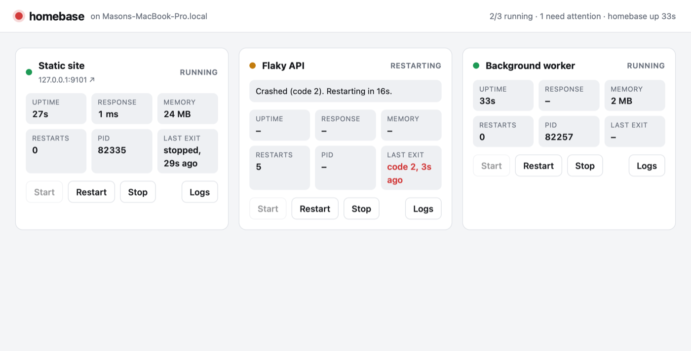

# homebase

A small process supervisor and dashboard for the apps I self-host on my
Windows desktop. It starts them at boot, restarts them when they crash,
health-checks them, and gives me one page (over Tailscale) to watch and
control them all. Add an app to a JSON file and it appears on the dashboard.

Written in Go with the standard library only: one `.exe`, no runtime to install.

<picture>
  <source media="(prefers-color-scheme: dark)" srcset="docs/dashboard-dark.png">
  
</picture>

## What it does

- **Starts every app** in `homebase.json` when it launches, with that app's
  own folder, arguments, and environment variables.
- **Restarts crashes** with exponential backoff (1s, 2s, 4s … up to 1 min),
  so a broken app doesn't spin the CPU. An app that ran stably for a minute
  gets a fresh backoff.
- **Health checks** each app's URL: status, response time, and optionally a
  restart after N failures in a row (a hung server that's still "running").
- **Tracks** uptime, memory, restart count, PID, and how/when it last exited.
- **Live logs:** stdout, stderr and homebase's own notes, streamed to the
  dashboard and saved to `logs/<app>.log` (rotated at 5 MB).
- **Start / Stop / Restart** buttons per app.
- **Never duplicates an app:** if something is already answering on an app's
  health URL (say, the old startup task), homebase reports it as *External*
  instead of starting a second copy that would fail on "port in use".
- **Phone alerts** through [ntfy](https://ntfy.sh): a crash loop, an app that
  crashed for good, or failing health checks, then a follow-up when it
  recovers. Optionally a morning "desktop is up: 2/2 apps running" check-in.
- **Leaves no orphans:** every app is placed in a Windows
  [Job Object](https://learn.microsoft.com/windows/win32/procthread/job-objects)
  that closes with homebase, so even if homebase is force-killed, Windows ends
  its apps too.

## Configuration

```jsonc
{
  "listen": "0.0.0.0:8090",        // dashboard address (firewalled to Tailscale)
  "log_dir": "logs",
  "apps": [
    {
      "name": "jobtracker",                      // ID used in URLs and log files
      "title": "Job Tracker",
      "dir": "C:\\Users\\Admin\\apps\\jobtracker",
      "command": "JobTracker.exe",               // relative to dir, or on PATH
      "args": ["--urls", "http://0.0.0.0:5206"],
      "env": { "ASPNETCORE_ENVIRONMENT": "Production" },
      "env_file": "C:\\Users\\Admin\\apps\\jobtracker\\jobtracker.env",  // secrets, never committed
      "url": "http://arkans-pc1:5206/",          // link on the dashboard
      "health": "http://127.0.0.1:5206/",        // polled for up/down
      "autostart": true,
      "restart": "on-failure",                   // or "always" / "never"
      "restart_when_unhealthy": true,
      "unhealthy_after": 3,
      "health_interval_sec": 15,
      "stop_timeout_sec": 10,
      "source": {                                // optional: lets update.ps1 pull and rebuild it
        "repo_dir": "C:\\Users\\Admin\\projects\\job-tracker",
        "build": ["dotnet", "publish", "src\\JobTracker", "-c", "Release", "-o", "C:\\Users\\Admin\\apps\\jobtracker"]
      }
    }
  ]
}
```

Only `name`, `dir` and `command` are required. **To add a project:** add an
entry, check it, then restart homebase:

```powershell
.\homebase.exe -check -config homebase.json   # validates paths, commands and env files; starts nothing
schtasks /End /TN homebase; schtasks /Run /TN homebase
```
 Unknown keys are rejected, so typos fail loudly
instead of being silently ignored. The desktop's real config is in
[`deploy/homebase.json`](deploy/homebase.json).

## Phone alerts

| Event | When | Priority |
|---|---|---|
| Crash loop | 3+ restarts within 10 minutes (configurable) | urgent |
| Crashed | exited and its restart policy says don't restart | urgent |
| Unhealthy | running, but the health check failed 3 times in a row | high |
| Recovered | an app you were alerted about is healthy again (a crash-looper must stay up for 2 min) | normal |
| Startup summary | about a minute after homebase starts, if `startup_summary` is on | low |

Deliberately quiet: a single crash that recovers on its own, apps you stopped
yourself, and states in transition (starting, stopping) don't notify.
Problems found at the same moment arrive as one notification, tapping it opens
the dashboard, and if the network isn't up yet (right after boot) delivery is
retried.

Setup:
1. Install the ntfy app on your phone and subscribe to a topic with a long
   random name. Anyone who guesses it can read your alerts.
2. On the desktop, create `C:\Users\Admin\apps\homebase\homebase.env`
   (see [`deploy/homebase.env.example`](deploy/homebase.env.example)) containing
   `NTFY_URL=https://ntfy.sh/<your-topic>`.
3. Test it: `homebase.exe -test-alert -config homebase.json`

```jsonc
"alerts": {
  "env_file": "C:\\Users\\Admin\\apps\\homebase\\homebase.env",  // holds NTFY_URL (keep it out of git)
  "dashboard_url": "http://arkans-pc1:8090/",   // opened when you tap a notification
  "startup_summary": true,
  "crash_loop_restarts": 3,
  "crash_loop_window_min": 10
}
```

A missing or broken alerts config never stops homebase. It logs a warning to
`logs\homebase.log` and runs without alerts.

## Install on the desktop

The desktop keeps a clone of this repo in `C:\Users\Admin\projects\homebase`
and builds from it. First-time setup, in an **elevated** PowerShell:

```powershell
git clone https://github.com/MasonKimball05/homebase.git C:\Users\Admin\projects\homebase
cd C:\Users\Admin\projects\homebase
New-Item -ItemType Directory -Force C:\Users\Admin\apps\homebase | Out-Null
go build -trimpath -o C:\Users\Admin\apps\homebase\homebase.exe .
Copy-Item deploy\homebase.json, scripts\install-windows.ps1 C:\Users\Admin\apps\homebase\
powershell -ExecutionPolicy Bypass -File C:\Users\Admin\apps\homebase\install-windows.ps1 -ReplaceOldTasks
```

The install script:
1. Moves Job Tracker's API key into `jobtracker.env`, readable only by your account.
2. Adds a firewall rule opening port 8090 to Tailscale addresses (`100.64.0.0/10`) only.
3. Registers a `homebase` scheduled task: starts at boot, whether or not you're
   logged in, no time limit, and restarts itself if it dies. Nothing else
   changes until this step succeeds.
4. With `-ReplaceOldTasks`: disables (not deletes) the old `app-jobtracker` and
   `app-sentinel` tasks and hands their apps to homebase. To roll back,
   re-enable those tasks.

Dashboard: **http://arkans-pc1:8090/**

## Updating from git

Make changes on the Mac, commit and push, then:

```bash
make update APP=homebase     # or APP=sentinel / APP=jobtracker
```

That runs [`scripts/update.ps1`](scripts/update.ps1) on the desktop over SSH:

- **An app** (any entry with a `source` block in `homebase.json`): `git pull
  --ff-only` in its repo, stop it through homebase (Windows locks a running
  `.exe`), run its build command, then start it again. If the build fails, the
  previous version starts back up.
- **homebase itself:** pull and build a new exe, run `-check` with it against
  the repo's `deploy/homebase.json`, and only then swap in the new exe and
  config and restart the task. The old versions are kept as `*.previous` for
  a one-step rollback.

`deploy/homebase.json` in this repo is the source of truth for the desktop's
config: edit it here, push, and `make update APP=homebase`.

## Security

- The dashboard can only start/stop apps **listed in the config file**. There is
  no API for running arbitrary commands, and the config isn't editable from the web.
- Access is limited to Tailscale by the Windows Firewall rule.
- Action endpoints require a custom `X-Homebase` header and reject cross-site
  `Sec-Fetch-Site`, so another website open in your browser can't press the
  buttons for you (CSRF). `GET` requests never change anything.
- App output is rendered as text only (never HTML), under a strict CSP.
- Secrets live in `env_file`s outside the repo. Env-file parse errors never
  echo the line, since it may contain a key.
- Apps run as a normal user, not elevated.

## How it works

```
main.go                      loads config, starts the Manager and the dashboard
internal/config/             JSON config + env-file parsing and validation
internal/supervisor/
  supervisor.go              one goroutine per app owns its process; buttons and
                             health checks send it requests over a channel
  proc_windows.go            taskkill /T, tasklist memory, Job Object
  proc_unix.go               process groups + SIGTERM/SIGKILL (for dev on a Mac)
  logs.go                    ring buffer + rotating log file
internal/alerts/             watches statuses, decides what's worth a notification, sends via ntfy
internal/web/                JSON API + embedded dashboard (HTML/CSS/JS)
scripts/install-windows.ps1  one-time desktop setup
scripts/update.ps1           pull + rebuild + redeploy an app (or homebase) from git
deploy/homebase.json         the desktop's live config
```

Each app's lifecycle is a small state machine: *stopped → starting → running*,
with *stopping*, *backoff* (waiting to restart), *crashed* and *external*.
Only the app's own goroutine changes its process. Everything else asks it to,
which avoids races like a restart and a crash-restart both launching a copy.

## Tests

```bash
make test    # vet (macOS + Windows) and tests with the race detector
```

The supervisor tests launch **real processes**: the test binary re-runs
itself as a tiny app that serves HTTP, crashes, or returns 500s. They cover
start/stop, crash backoff, restart policies, unhealthy restarts, external-copy
detection, env files and shutdown. They've been run on Windows 11 as well as
macOS, along with a manual check that force-killing homebase takes its apps
down with it.

## Ideas

- CPU usage and a small response-time sparkline per app
- Reload the config without restarting homebase
- "Deploy" button: pull and rebuild an app from its git repo

## License

MIT, see [LICENSE](LICENSE).
